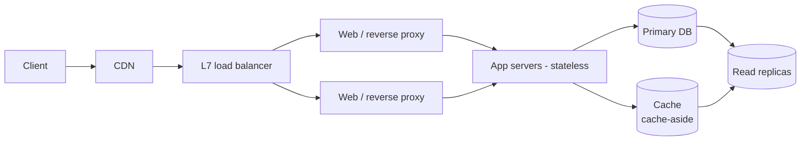
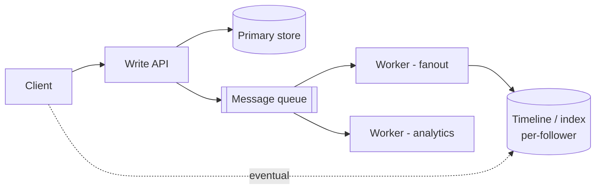
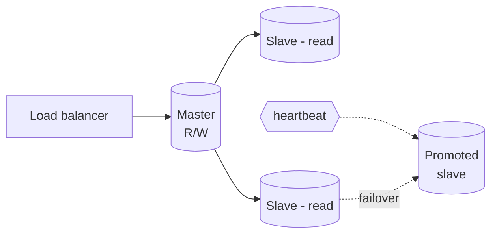
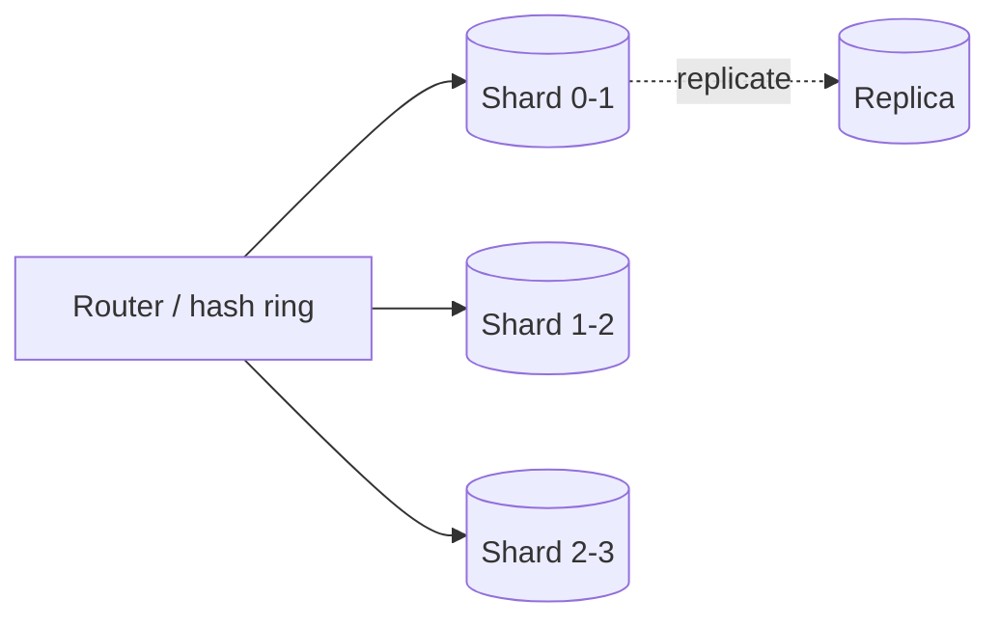
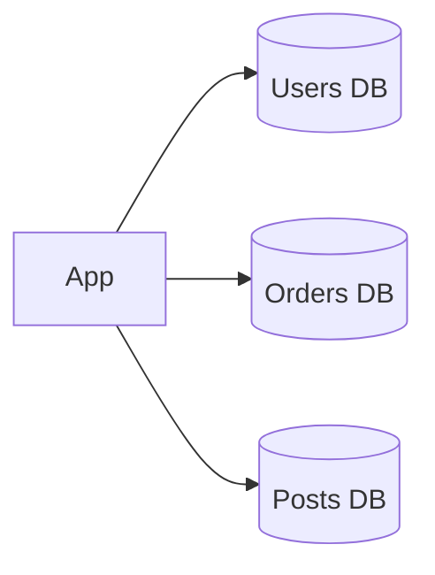
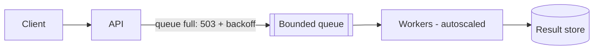
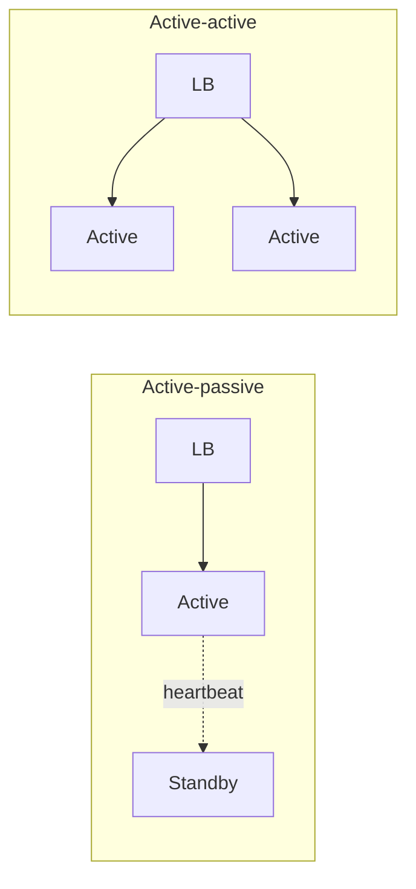
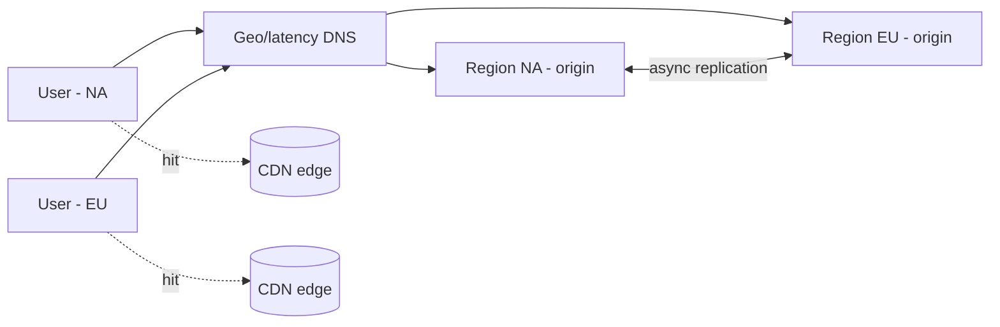

# Diagram snippet library (mermaid)

Paste-ready patterns for `design`/`review` modes. Adapt names; keep labels short. Pair every added box with its trade-off in prose.

## 1. Basic 3-tier + cache (starting point for most drills)

## 2. Write path with async fanout (feeds, notifications, timelines)

Trade-offs: queue adds delay + at-least-once duplicates (idempotency); fanout-on-write costs storage, fanout-on-read costs read latency.

## 3. Master–slave replication + failover

Trade-offs: read scale + HA vs replication lag, promotion logic, unreplicated-write loss window.

## 4. Sharding (consistent hashing)

Trade-offs: horizontal growth vs cross-shard joins, hot-shard skew, rebalancing (consistent hashing minimizes moves).

## 5. Federation (functional partitioning)

Trade-offs: less traffic per DB + cache locality vs app-level routing and painful cross-DB joins.

## 6. Job pipeline with back pressure

## 7. Active–passive vs active–active edge

## 8. Multi-region read path (CDN + geo DNS)

## Conventions

- Solid arrow = synchronous request path; dashed = async/replication/eventual.
- Double parentheses `[( )]` = data store; `[[ ]]` = queue.
- Always show the LB (or note internal LBs elided) and mark stateless app tier.
- Annotate the consistency choice on cross-node arrows (sync vs async).
