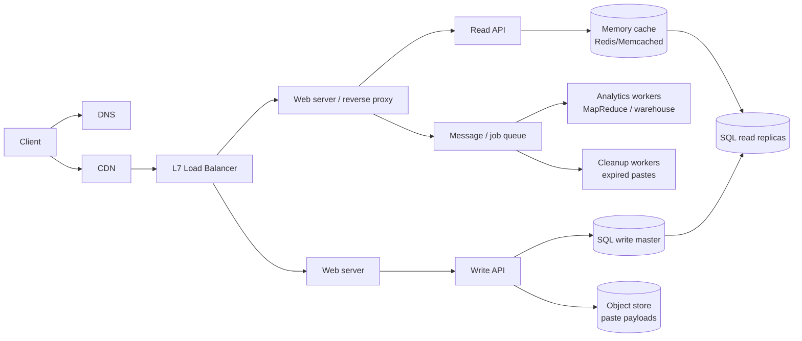

# Worked exemplar: Design Pastebin / URL shortener (condensed)

Self-contained model answer mirroring the primer's full solution (`solutions/system_design/pastebin/README.md` when the repo is present). **Mirror this structure and depth** for greenfield `design`/`interview` answers. Every fix names its trade-off.

## Step 1 — Use cases, constraints, assumptions

**In scope**
- User submits text → gets a random short link (optional timed expiration)
- User opens a short link → views contents
- Anonymous users; service tracks page-view analytics; deletes expired pastes
- High availability required

**Out of scope:** accounts/login, editing, visibility settings, custom slugs

**Assumptions:** traffic unevenly distributed; following a link must be fast; pastes are text-only; analytics needn't be realtime; 10M users; 10M writes + 100M reads per month; read:write ≈ 10:1

**Estimates** (reproduce with `scripts/estimate.py full --reads-month 100000000 --writes-month 10000000 --record-bytes 1300 --read-bytes 5000`)

| Metric | Value |
|---|---|
| Size per paste | ~1.27 KB (content 1 KB + metadata) |
| New data | ~12.7 GB/month → ~450 GB in 3 years |
| Writes | ~4/s average (peak ~10/s at 2.5×) |
| Reads | ~40/s average (peak ~100/s) |
| Shortlink space | 62^7 ≈ 3.5 trillion ≫ 360M links/3yr |

Conversion: 1 rps ≈ 2.5M requests/month.

## Step 2 — High-level design



Justify each box: CDN/LB → absorb spikes, remove SPOFs; cache → hot reads off the DB; master/slave → write/read split; object store → cheap blob storage; queue → analytics + expiry don't sit on the request path.

**API (REST, public):**

```
POST /api/v1/paste   {paste_contents, expiration_length_in_minutes?} → {shortlink}
GET  /api/v1/paste?shortlink=foobar → {paste_contents, created_at, expiration...}
```

**Schema:**

```sql
pastes(
  shortlink char(7) PRIMARY KEY,          -- uniqueness via PK index
  expiration_length_in_minutes int NOT NULL,
  created_at datetime NOT NULL,           -- secondary index: expiry scans + hot-in-memory
  paste_path varchar(255) NOT NULL
)
```

## Step 3 — Core components

**Write path**
1. Client → web server → Write API
2. Generate key: `base62(md5(ip + timestamp))[:7]` — uniform (MD5), URL-safe alphabet `[a-zA-Z0-9]` (no escaping like base64's `+/`), deterministic; check uniqueness against PK, regenerate on collision
3. Insert row into `pastes`; store payload in object store; return shortlink

**Read path**
1. Client → web server → Read API
2. Cache-aside on `shortlink` → miss → read replica → populate cache → serve
3. Unknown link → 404 with message

**Analytics (not realtime):** MapReduce web-server logs → (period, url) counts → warehouse (Redshift/BigQuery).

**Expiry:** workers scan `created_at`/expiration index for rows older than now → delete or mark expired (indexed scan, not full table scan).

Code depth: only as much as requested — "Clarify how much code you are expected to write."

## Step 4 — Scale (iterative, not a jump to the final design)

State the loop: **benchmark/load-test → profile → fix bottleneck while weighing alternatives → repeat.**

| Pressure at scale | Fix | Trade-off accepted |
|---|---|---|
| 40 avg reads/s (higher at peak), uneven | Memory cache in front of DB | Invalidation complexity; cold misses (TTL, refresh-ahead) |
| Cache misses / analytics load | SQL read replicas | Replication lag (stale reads); replay burden on slaves |
| Writes only ~4/s | Single master-slave is enough for now | Federation/sharding/denormalization only when numbers demand it |
| 450 GB blobs / 3 yr | Object store (S3) | Hop to another service; cost per GB |
| Burst spikes, geo latency | CDN for static + popular paste reads | CDN cache invalidation on expiry |
| Analytics + expiry off request path | Queue + workers | Eventual completion; at-least-once → idempotent jobs |
| Master failure | Failover to promoted slave | Possible loss of unreplicated writes; promotion logic |

**Do not jump straight to sharding.** Justify each addition against the Step 1 numbers; name the next scaling lever (federation → sharding → denormalization → SQL tuning) only if the current one breaks.

**Closing (use `references/rubric.md` checklist):** SPOFs (master, single LB → redundant pairs), hotspot URLs → cache + CDN, invalidation on expiry → TTL + cleanup job, lag → accept stale reads for analytics but not for fresh pastes written by the same user (session stickiness or read-your-writes to master for that flow).

## Further practice

- Same shape applies to Bit.ly (hash the original URL instead of storing content).
- Other technique tags → questions: `references/questions.md`; diagrams to adapt: `references/diagrams.md`.
- With repo present: full write-up + diagrams in `solutions/system_design/pastebin/`, runnable `pastebin.py`.
